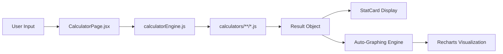

<div align="center">

# ⚡ CalcVision

### All-in-One Calculator Platform · PWA · 70+ Tools

[](https://smart-cal-tan.vercel.app/)
[](https://react.dev)
[](https://vite.dev)
[](https://web.dev/progressive-web-apps/)
[](LICENSE)

**CalcVision** is a modern, privacy-first calculator platform with **70+ production-ready tools** spanning finance, health, math, science, shopping, personal & travel — all running instantly in your browser with beautiful visual insights.

*No accounts · No tracking · No backend · Installable PWA · Works offline*

</div>

---

## ✨ Key Features

| Feature | Description |
|---------|-------------|
| 🧮 **70+ Calculators** | Production-ready tools across 7 categories with real mathematical formulas |
| 📊 **Auto-Graphing Engine** | Dynamic Recharts-powered visualizations (bar charts, pie charts, radial gauges) generated automatically for any output |
| 📱 **Installable PWA** | Add to home screen on any device — works offline like a native app |
| 🎬 **Animated Splash Screen** | Premium launch animation with rotating rings, floating particles & math symbols |
| 🌙 **Dark & Light Mode** | Seamless theme switching with system preference detection |
| 🔒 **100% Private** | Zero data collection — everything runs client-side in your browser |
| ⚡ **Lightning Fast** | No server round-trips — instant calculations with zero latency |
| 🎨 **Premium UI** | Glassmorphism navbar, gradient accents, Framer Motion animations throughout |

---

## 🧱 Tech Stack

| Layer | Technology |
|-------|-----------|
| ⚛️ **UI Framework** | React 18 |
| ⚡ **Build Tool** | Vite 6 |
| 🎨 **Styling** | Tailwind CSS |
| ✨ **Animations** | Framer Motion |
| 📊 **Charts** | Recharts |
| 🧭 **Routing** | React Router v6 |
| 📱 **PWA** | Custom Service Worker + Web App Manifest |
| 🚀 **Hosting** | Vercel (static) |

---

## 📊 Calculator Categories

CalcVision ships with **70 production-ready calculators** organized into category subfolders:

### 💰 Finance (10 calculators)
| Calculator | Description |
|-----------|-------------|
| EMI | Equated Monthly Installment with amortization schedule |
| Compound Interest | Future value with compounding frequency options |
| Simple Interest | Principal, rate & time based interest |
| SIP | Systematic Investment Plan projections |
| GST | Indian GST with CGST/SGST/IGST breakdown |
| Income Tax | Indian tax slab calculator (Old & New regime) |
| ROI | Return on Investment evaluator |
| Inflation | Purchasing power erosion over time |
| Mortgage | Home loan with property tax & insurance |
| Retirement | Corpus planning with monthly savings estimate |

### ❤️ Health (10 calculators)
| Calculator | Description |
|-----------|-------------|
| BMI | Body Mass Index with health risk classification |
| BMR | Basal Metabolic Rate (Mifflin-St Jeor equation) |
| TDEE | Total Daily Energy Expenditure by activity level |
| Macros | Daily protein, carb & fat targets |
| Body Fat | U.S. Navy circumference method |
| Water Intake | Daily hydration recommendation |
| Target Heart Rate | Karvonen formula for exercise zones |
| Calorie Burn | MET-based activity calorie estimator |
| Pregnancy Due Date | Naegele's rule with trimester tracking |
| Ideal Weight | Devine, Robinson, Miller & Hamwi formulas |

### 📐 Math (10 calculators)
| Calculator | Description |
|-----------|-------------|
| Average | Mean, median, mode & range |
| Percentage | Percentage of/change/increase/decrease |
| Factorial | n! with digit count & trailing zeros |
| Fraction | Add, subtract, multiply & divide fractions |
| Quadratic | Quadratic equation solver (ax² + bx + c = 0) |
| LCM & GCD | Euclidean algorithm for LCM/GCD |
| Standard Deviation | Variance, σ & coefficient of variation |
| Trigonometry | Sin, cos, tan with degree/radian support |
| Logarithm | log₁₀, ln & custom base logarithms |
| Prime Factor | Prime factorization with primality test |

### 🔬 Science (10 calculators)
| Calculator | Description |
|-----------|-------------|
| Temperature | Celsius ↔ Fahrenheit ↔ Kelvin converter |
| Speed/Distance/Time | Motion equations with unit conversions |
| Density | Mass, volume & density relationships |
| Kinetic Energy | ½mv² energy calculator |
| Ohm's Law | Voltage, current & resistance |
| Force & Acceleration | Newton's Second Law (F = ma) |
| Wavelength | Wave speed, frequency & wavelength |
| Ideal Gas Law | PV = nRT with multiple solve modes |
| Work & Power | Mechanical work and power output |
| Gravitational Force | Newton's Universal Gravitation |

### 🛒 Shopping (9 calculators)
| Calculator | Description |
|-----------|-------------|
| Discount | Flat & percentage discount with savings |
| Unit Price | Compare prices per unit between products |
| Sales Tax | Add or extract tax from prices |
| BOGO | Buy One Get One deal evaluator |
| Electricity Cost | Monthly/yearly appliance running cost |
| Profit Margin | Margin, markup & break-even analysis |
| Clothing Size | US ↔ UK ↔ EU size converter |
| Coupon Stacking | Sequential multi-discount calculator |
| Price Inflation | Historical price adjustment by CPI |

### 👤 Personal (11 calculators)
| Calculator | Description |
|-----------|-------------|
| Age | Exact age in years, months, days & more |
| Tip | Multi-tier tipping with etiquette hints |
| Date Duration | Days, weeks & months between two dates |
| Timesheet | Weekly/monthly earnings from work hours |
| Sleep Cycle | Optimal bedtimes based on 90-min REM cycles |
| Reading Time | Book reading time estimator |
| Pet Age | Dog/cat to human years converter |
| Habit Streak | Milestone projector for daily habits |
| Screen Time | Daily screen hours → weekly/yearly/lifetime |
| Zodiac | Sun sign, element, quality & birthstone |
| Event Budget | Wedding/event budget allocation tool |

### ✈️ Travel (10 calculators)
| Calculator | Description |
|-----------|-------------|
| Fuel Cost | Trip fuel cost with mileage sensitivity |
| Fuel Efficiency | MPG ↔ km/L ↔ L/100km converter |
| Travel Time / ETA | Arrival time with stops & speed |
| Time Zone | Convert time across UTC offsets |
| Road Trip Split | Split expenses among travelers |
| Baggage Fee | Airline overweight fee estimator |
| Flight Carbon | CO₂ emissions by flight class |
| Pace | Running/walking pace & race predictor |
| Auto Loan | Vehicle financing EMI & total cost |
| Currency Shopping | Exchange rate converter for travelers |

---

## 📂 Project Structure

```
SmartCal/
├── Frontend/
│   ├── public/
│   │   ├── manifest.json            # PWA manifest
│   │   ├── sw.js                    # Service worker (offline caching)
│   │   └── icon-512.png             # App icon (512×512)
│   │
│   ├── src/
│   │   ├── engine/                  # Calculator logic (client-side)
│   │   │   ├── calculatorEngine.js  # Auto-discovery registry & runner
│   │   │   └── calculators/         # 70 calculator modules
│   │   │       ├── finance/         # EMI, SIP, GST, mortgage, etc.
│   │   │       ├── health/          # BMI, BMR, TDEE, macros, etc.
│   │   │       ├── math/            # Average, factorial, quadratic, etc.
│   │   │       ├── science/         # Temperature, Ohm's law, etc.
│   │   │       ├── shopping/        # Discount, BOGO, unit price, etc.
│   │   │       ├── personal/        # Age, tip, sleep cycle, etc.
│   │   │       └── travel/          # Fuel cost, ETA, pace, etc.
│   │   │
│   │   ├── components/              # Reusable UI components
│   │   │   ├── Navbar.jsx           # Glassmorphism navbar with search
│   │   │   ├── Hero.jsx             # Landing hero with quick links
│   │   │   ├── Footer.jsx           # Footer with category links
│   │   │   ├── SplashScreen.jsx     # Animated PWA splash screen
│   │   │   ├── CalculatorCard.jsx   # Calculator grid card
│   │   │   └── CategorySection.jsx  # Category filter pills
│   │   │
│   │   ├── pages/                   # Route pages
│   │   │   ├── Home.jsx             # Main landing + calculator grid
│   │   │   ├── CalculatorPage.jsx   # Calculator UI + Auto-Graphing Engine
│   │   │   ├── Categories.jsx       # Filterable category browser
│   │   │   ├── About.jsx            # About page with feature showcase
│   │   │   └── NotFound.jsx         # 404 page
│   │   │
│   │   ├── services/api.js          # Client-side API adapter
│   │   ├── context/ThemeContext.jsx  # Dark/light theme state
│   │   ├── routes/AppRoutes.jsx     # Route definitions
│   │   ├── App.jsx                  # Root app with splash gate
│   │   ├── main.jsx                 # Vite entry point
│   │   └── index.css                # Global styles
│   │
│   ├── index.html                   # HTML with PWA meta tags
│   ├── package.json
│   ├── vite.config.js
│   ├── tailwind.config.js
│   └── postcss.config.js
│
└── README.md
```

---

## ⚙️ Getting Started

### Prerequisites

- **Node.js** 18+ and **npm** 9+

### 1. Clone & Install

```bash
git clone https://github.com/ParthaG23/SmartCal.git
cd SmartCal/Frontend
npm install
```

### 2. Run Dev Server

```bash
npm run dev
```

App runs at → **http://localhost:5173**

### 3. Build for Production

```bash
npm run build
```

Output goes to `dist/` — deploy to any static host.

---

## 🚀 Deployment

### Vercel (Recommended)

```bash
vercel
```

No environment variables needed — everything runs client-side.

### Other Static Hosts

The `dist/` folder works with **Netlify, GitHub Pages, Cloudflare Pages**, or any static file server.

---

## 🏗️ Architecture



### How It Works

1. **Auto-Discovery**: `calculatorEngine.js` uses `import.meta.glob("./calculators/**/*.js")` to automatically find and register all calculator modules from category subfolders
2. **Standard Module Format**: Each calculator exports `{ name, slug, category, description, fields, run() }`
3. **Dynamic UI**: `CalculatorPage.jsx` renders input fields from the `fields` array and calls `run()` on submit
4. **Smart Charting**: The Auto-Graphing Engine strips currency symbols and units, then auto-generates bar charts, pie charts, or radial gauges based on the numeric output shape

### Adding a New Calculator

Create a file in `src/engine/calculators/<category>/`:

```javascript
export default {
  name: "My Calculator",
  slug: "my-calculator",
  category: "Math",
  description: "Does something useful",
  fields: [
    { name: "value", label: "Input Value", type: "number", placeholder: "42" },
  ],
  run: ({ value }) => {
    const v = parseFloat(value);
    if (!v) throw new Error("Value required");
    return { result: v * 2, doubled: v * 2 };
  },
};
```

That's it — the engine auto-discovers it, the UI renders it, and the charting engine graphs it.

---

## 🔒 Privacy

- ✅ No accounts or login required
- ✅ No data ever leaves your browser
- ✅ No tracking, cookies, or analytics
- ✅ No backend or database
- ✅ PWA-enabled — works offline after first visit
- ✅ Fully open source

---

## 📱 PWA Installation

CalcVision is a fully installable Progressive Web App:

1. Open **https://smart-cal-tan.vercel.app/** on your phone
2. Tap **"Add to Home Screen"** (or the install prompt)
3. Launch it like a native app — works offline!

---

## 🧑‍💻 Author

**Partha Gayen**

[](https://github.com/ParthaG23)
[](https://www.linkedin.com/in/partha-gayen)

---

## 📜 License

This project is licensed under the **MIT License** — see the [LICENSE](LICENSE) file for details.

---

<div align="center">
  <br />
  <strong>⚡ CalcVision</strong> · Calculate smarter. See clearer.
  <br />
  <sub>Built with ❤️ using React, Vite, Tailwind & Recharts</sub>
</div>
